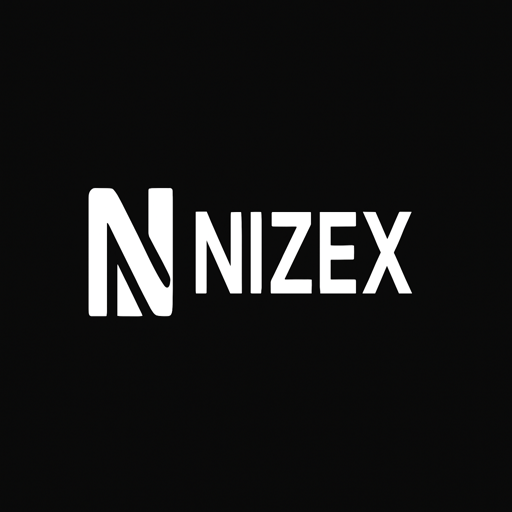

<h1 align="center"> NIXEX AI</h1>

#  NIZEX — Neural Intelligence with Zero-Latency Enhanced Experience
<p align="center">
  
</p>
NIZEX V0.5 is a next-generation AI assistant built to deliver instant, meaningful intelligence with a fully personalized interaction experience.  
Designed for data analytics, automation, productivity, and intelligent task execution — all at the **speed of thought**.

---
<p align="center">
  
  
  
</p>

[](https://www.kaggle.com/kernels/welcome?src=https://github.com/NIZAM531/NIZEX---Neural-Intelligence-with-Zero-Latency-Enhanced-Experience/blob/main/nixex-v0-5.ipynb)

[](https://colab.research.google.com/github/NIZAM531/NIZEX---Neural-Intelligence-with-Zero-Latency-Enhanced-Experience/blob/main/nixex-v0-5(1).ipynb)
[](https://colab.research.google.com/github/YOUR-USERNAME/NIZEX---Neural-Intelligence-with-Zero-Latency-Enhanced-Experience/blob/main/nixex-v0-5.ipynb)

---
## 🔥 Features
✅ **Neural Intelligence**
- Understands intent, context, and complex queries
✅ **Zero-Latency Responses**
- Optimized for fast inference
✅ **Enhanced Personal Experience**
- Learns preferences and adapts over time
✅ **Analytics & Insights**
- Can summarize data, detect patterns, and highlight trends
✅ **Conversation Memory**
- Smarter interactions over time
✅ **Automation Support**
- Can assist in workflows, documents, tasks, and more

---
## 🎯 Vision

To create an **intelligent, adaptive, human-centric AI** capable of boosting productivity, simplifying workflows, and delivering insights instantly.

---

## 🧩 Use-Cases  

- 📊 Data Analytics
- 📚 Research Assistance
- 🧾 Document Summarization
- 🧠 Memory-Based AI Chat
- 🧰 Workflow Automation
- 🤖 Personal Productivity

---

## 💡 Coming Soon   

- Offline AI model support  
- Excel integration  
- Voice interaction  
- Plugin ecosystem  

---

## 🖥️ Tech Stack (Suggested)

- Python / Node.js backend
- Transformer-based LLM interface
- Vector embeddings for memory
- Streamlit/React UI

---

## 📦 Installation (Placeholder) 

```bash
git clone https://github.com/YOUR-USERNAME/NIZEX.git
cd NIZEX
npm install  # or pip install -r requirements.txt
